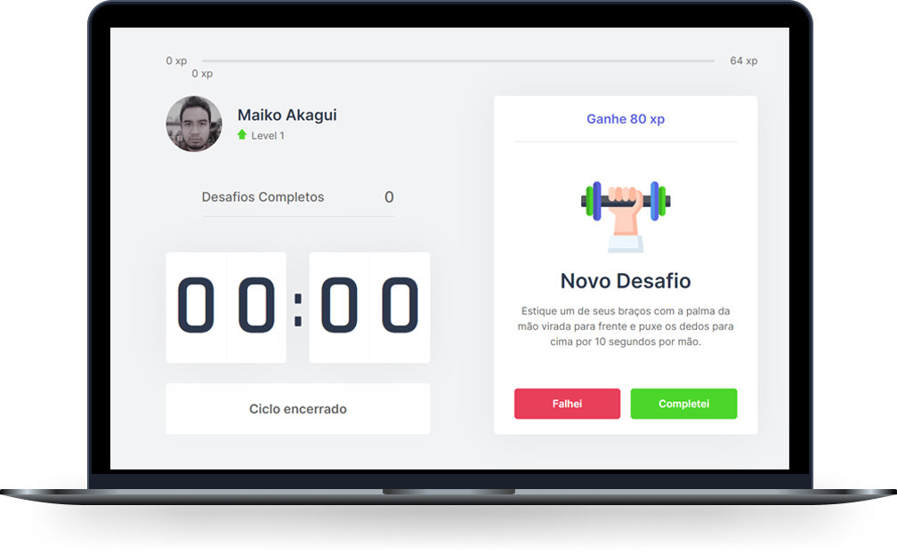

<h1 align="center">
  
</h1>

  <a href="#-tecnologias">Tecnologias</a>&nbsp;&nbsp;&nbsp;|&nbsp;&nbsp;&nbsp;
  <a href="#-projeto">Projeto</a>&nbsp;&nbsp;&nbsp;|&nbsp;&nbsp;&nbsp;
  <a href="#-como-executar">Como executar</a>&nbsp;&nbsp;&nbsp;|&nbsp;&nbsp;&nbsp;
  <a href="#iphone-demo-deploy">Demo</a>&nbsp;&nbsp;&nbsp;|&nbsp;&nbsp;&nbsp;
    <a href="#-Contatos">Contatos</a>&nbsp;&nbsp;&nbsp;|&nbsp;&nbsp;&nbsp;
  

  

 

 

  

## ✨ Tecnologias

Esse projeto foi desenvolvido com as seguintes tecnologias:

- [React](https://reactjs.org)
- [Next.js](https://nextjs.org/)
- [TypeScript](https://www.typescriptlang.org/)

## 💻 Projeto

O Mkmoveit é um app que une a técnica de Pomodoro com a realização de exercícios físicos para quem passa muito tempo na frente do computador, aumentando assim a produtividade e a concentração durante o trabalho e os estudos.

## 🚀 Como executar

- Clone o repositório
- Instale as dependências com `yarn`
- Inicie o servidor com `yarn dev`

Agora você pode acessar [`localhost:3000`](http://localhost:3000) do seu navegador.

## :iphone: Demo: Deploy

A aplicação Web poderá ser acessada aqui:https://mkmoveit.vercel.app/

## :mailbox_with_no_mail: Contatos

Email: maiko.akagui.duarte@gmail.com  
Linkedin: www.linkedin.com/in/maiko-akagui-duarte-253649129
